<div align="center">
  <h1>Private Cloud Storage System</h1>
  <p><strong>Powered by HDFS, Docker, Flask, and React</strong></p>
</div>

The objective of this project is to design and implement a secure **private cloud storage system**. It allows users to upload, download, and manage encrypted files through a beautiful web-based dashboard. The system leverages **distributed storage** using Hadoop Distributed File System (HDFS), robust containerized architecture with Docker, and a globally accessible private network using Tailscale.

---

## System Architecture

The system follows a highly scalable **layered architecture**:

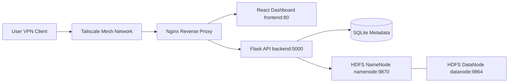

### Components:
* **Frontend**: React Dashboard (User Interface built using Vite + Tailwind CSS)
* **Backend**: Flask REST API (Business logic & AES Encryption)
* **Storage**: HDFS (Distributed File Storage containing NameNode & DataNode)
* **Reverse Proxy**: NGINX (Routing API vs Frontend Traffic)
* **Containerization**: Docker & Docker Compose
* **Access Layer**: Tailscale P2P VPN

---

## Technologies Used

| Layer | Technology |
| :--- | :--- |
| **Frontend** | React, Vite, TailwindCSS, Framer Motion, Lucide React |
| **Backend** | Python, Flask, Cryptography (Fernet) |
| **Database** | SQLite3 (Metadata) |
| **Storage** | Hadoop Distributed File System (HDFS) |
| **Networking** | NGINX, Tailscale |
| **Deployment** | Docker, Docker Compose |

---

## Infrastructure & Deployment Setup

All services are containerized and orchestrated via `docker-compose.yml`. 

### Directory Structure:
```text
cloud-system/
│
├── docker-compose.yml
└── nginx/
    └── nginx.conf
`

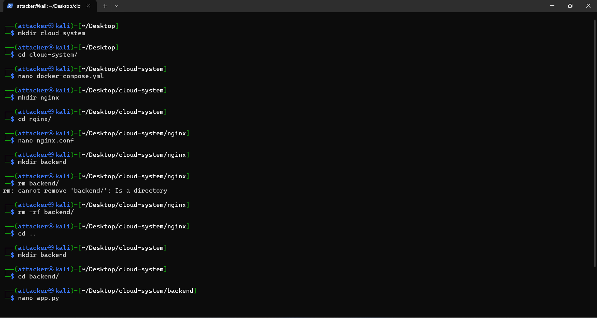

### 1. HDFS Configuration
*   **NameNode** manages HDFS metadata and filesystem directories.
*   **DataNode** stores actual file blocks.
The crucial configuration ensuring DataNodes properly connect to NameNodes:
```yaml
CORE_CONF_fs_defaultFS=hdfs://namenode:9000
```

### 2. Network Deployment (Docker Compose)
*   Isolated bridging for internal microservices (`frontend`, `backend`, `namenode`, `datanode`).
*   NGINX maps incoming port `8082` to appropriate internal containers.


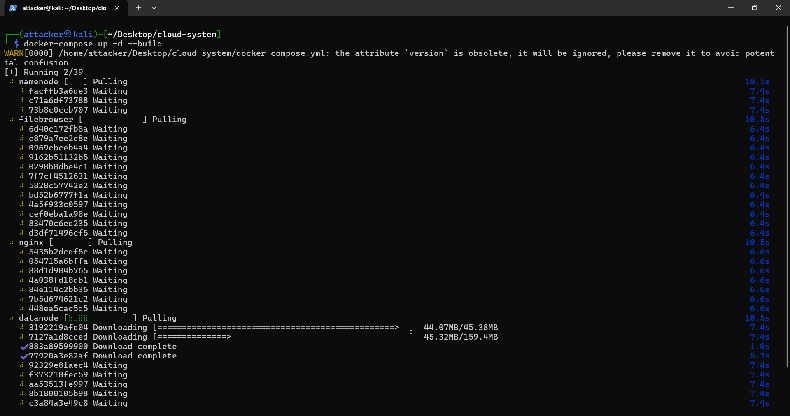

---

## Secure Remote Access (Tailscale Setup)

To allow access from anywhere without port-forwarding routers or exposing the server to the public WAN:
1. **Install Tailscale** on your cloud server (e.g., Kali VM / Ubuntu).
2. Run `sudo tailscale up` to authenticate the machine into your private Tailnet.
3. Obtain the Tailscale IP of your server (e.g., `100.93.190.2`).
4. Connect to the same Tailscale network from any standard device (laptop/phone).
5. Access your cloud dashboard globally at `http://100.93.190.2:8082`.


.png)
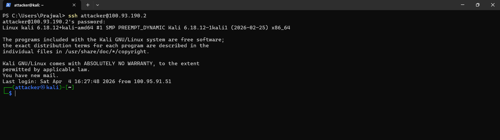

---

## Backend Implementation

Built using Python's **Flask** framework, tightly tied with the `hdfs` python client.

### Endpoints
*   `POST /upload` - Encrypts file chunks via `Fernet` AES-128 and pipes it to HDFS.
*   `GET /files` - Queries SQLite to fetch stored metadata.
*   `GET /download/<filename>` - Streams byte-data out of HDFS, decrypts it on the fly, and serves the file block to the frontend.
*   `DELETE /delete/<filename>` - Removes the target file out of the NameNode and unlinks the SQLite metadata record.
*   `GET /stats` - Aggregated calculation of network pings, block sizes, and node counts.


### Security Enhancements
*   All user files undergo **AES encryption before entering HDFS logic**.
*   Decryption triggers exclusively downstream during an authenticated fetch request.
*   Persistent metadata stored separately from binary blobs: Title, Original Size, Timestamp, Encryption flag.

---

## Frontend Dashboard

Implemented completely natively in **React (Vite)** with advanced styling:
*   **Glassmorphism UI** using `framer-motion` for fluid page transitions.
*   Dashboard & Stats Multi-Page layout via `react-router-dom`.
*   Interactive Dropzones for seamless uploads.
*   Aesthetic file cards equipped with one-click download/delete actions.
*   Hardcoded Auth Gateway bridging private sessions.

### User Interface
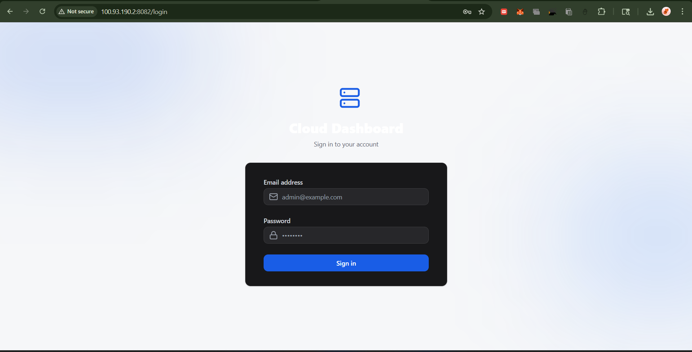

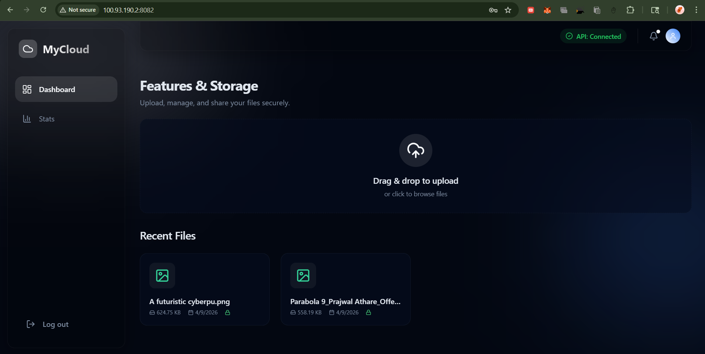

### Analytics
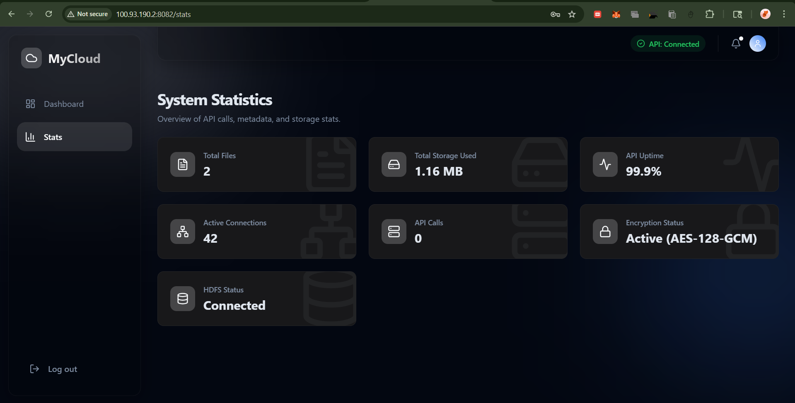

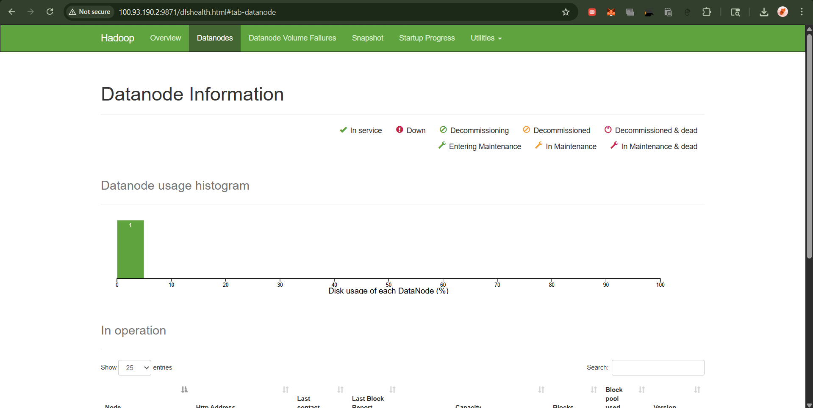

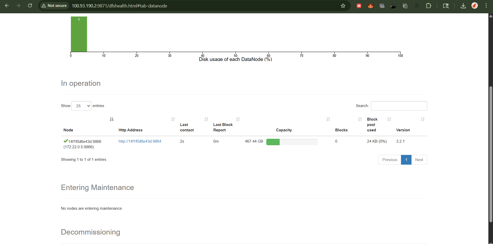

### File Operations
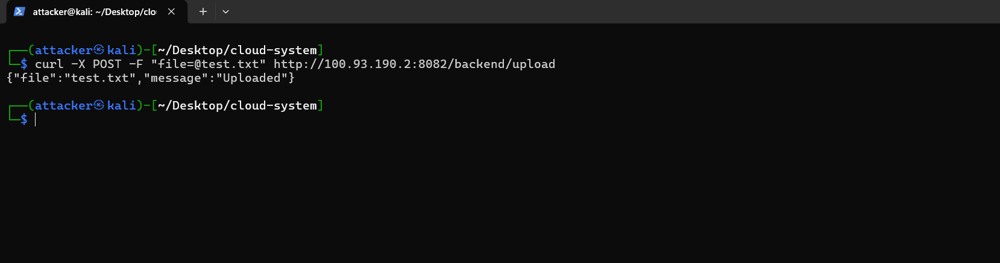

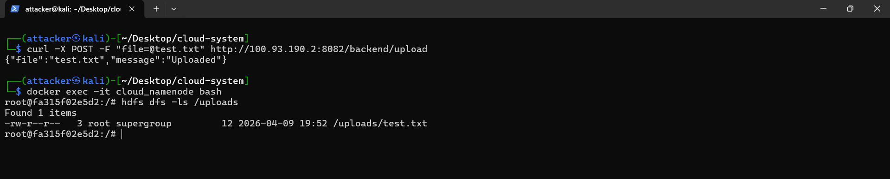

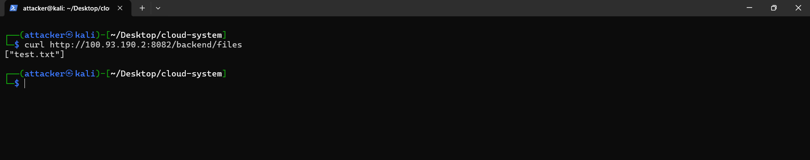

---

## Quick Test Sandbox

You can test connections to your system directly using `cURL`:

**Upload Test:**
```bash
curl -X POST -F "file=@test.txt" http://100.93.190.2:8082/backend/upload
```

**List Files:**
```bash
curl http://100.93.190.2:8082/backend/files
```

---

## Future Enhancements
*   [ ] Implement formal JWT Authentication & User Accounts.
*   [ ] Role-Based Access Control (RBAC).
*   [ ] Deep Folder Hierarchy support (Sub-folders).
*   [ ] Chunked File Upload for extreme File Sizes.
*   [ ] Image / PDF inline previews.
*   [ ] Expand HDFS with multi-node slave scaling architecture.

---

<div align="center">
  <p><strong>Developed & Engineered for scalable Cloud Storage Infrastructures.</strong></p>
</div>
